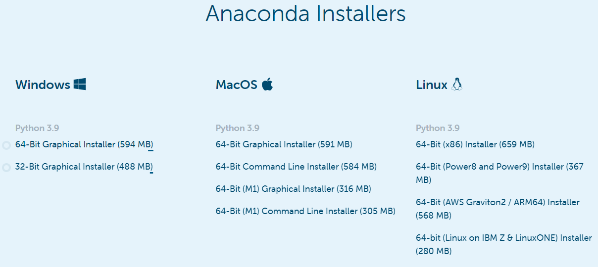
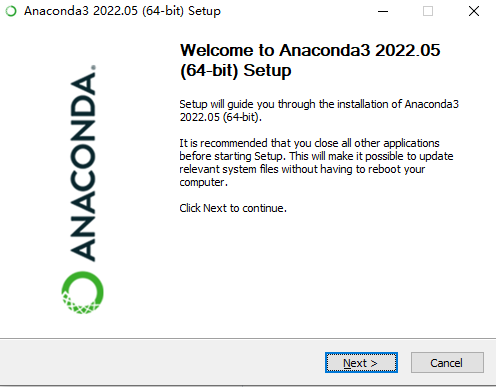
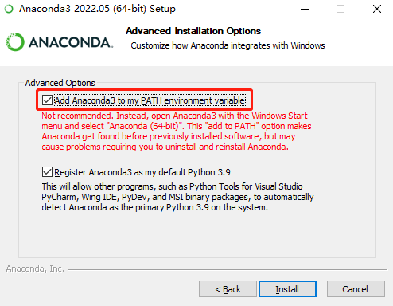

### 1. Installing Anaconda on Your Platform

**Step 1 - Download Anaconda**

​      On the web browser, in the official site of [anaconda](https://www.anaconda.com/products/distribution#Downloads), you can download the anaconda installer according to your system.



**Step 2 - Run Executable Installer**

- Windows

  Run the installer and click **next**.

  

  Make sure to select the checkbox of **Add Anaconda3 to my PATH environment variable**.

  

- MacOS

  1. Open the **.pkg** installer and follow the installation instructions. It is advised that you install **Anaconda** for the current user and that **Anaconda** **is added to your PATH**.

  2. Once Anaconda is installed, you need to load the changes to your `PATH` environment variable in the current terminal session.

     Open the MacOS Terminal and type:

     ```
     $ cd ~
     $ source .bashrc
     ```

- Linux

  Open the Linux terminal and type and press **enter**:

  ```
  $ bash anaconda-xxx.sh
  ```

**Step 3 - Verify Python is installed on your platform **

​     Open the **command prompt** (windows) or **Terminal** (mac os) and type:	

```
$ python
```

You should see something like

```
Python 3.6.3 | Anaconda Inc. |
```

At the Python REPL (the Python `>>>` prompt) try:

```
>>> import this
```

If you see the Zen of Python, the installation was successful. Exit out of the Python REPL using the command `exit()`. Make sure to include the double parenthesis `()` after the `exit` command.

```
>>> exit()
```

