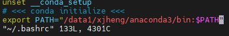
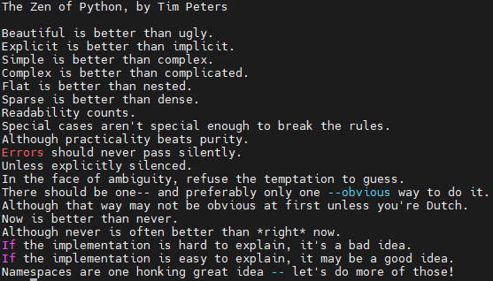

### 1. Install Anaconda on Your Platform

**Step 1 - Download Anaconda**

​      On the web browser, in the official site of [anaconda](https://www.anaconda.com/products/distribution#Downloads), you can download the anaconda installer according to your system.


**Step 2 - Run Executable Installer**

- Windows

  Run the installer and click **next**.

  

  Make sure to select the checkbox of **Add Anaconda3 to my PATH environment variable**.

  

  You can **manually add the path of Anaconda3** to the PATH environment variable and there are instructions from [csdn blog](https://blog.csdn.net/u013211009/article/details/78437098).

- MacOS

  1. Open the **.pkg** installer and follow the installation instructions. It is advised that you install **Anaconda** for the current user and that **Anaconda** **is added to your PATH**.

  2. Please make sure **Anaconda3 PATH** is added to the environment, Open the MacOS Terminal and type:

     ```
     $ vim ~/.bashrc
     ```

     

     If not, you can manually Add `export PATH="/your/path/to/anaconda3/bin:$PATH"` to **.bashrc**

  3. Once Anaconda is installed, you need to load the changes to your `PATH` environment variable in the current terminal session.

     ```
     $ source ~/.bashrc
     ```

- Linux

  Open the Linux terminal and follow the installation instructions:

  ```
  $ bash anaconda-xxx.sh
  ```

  Please make sure **Anaconda3 PATH** is added to the environment, Open the Terminal and type:

  ```
  $ vim ~/.bashrc
  ```

  
  
  If not, you can manually Add `export PATH="/your/path/to/anaconda3/bin:$PATH"` to **.bashrc**, then update the changes in the current terminal session via:
  
  ```$ source ~/.bashrc
  $ source ~/.bashrc
  ```

**Step 3 - Verify Python is installed on your platform**

​     Open the **command prompt** (windows) or **Terminal** (mac os, linux) and type:	

```
$ python
```

You should see something like

```
Python 3.6.3 | Anaconda Inc. |
```

At the Python REPL (the Python `>>>` prompt) try:

```
>>> import this
```

If you see the Zen of Python, the installation was successful. 



Exit out of the Python REPL using the command `exit()`. Make sure to include the double parenthesis `()` after the `exit` command.

```
>>> exit()
```

### 2. Install Sublime Text

For convenience, I recommend **Sublime Text** for coding your projects. You can download it on [the official website](https://www.sublimetext.com/) according to your system.

### 3. Read and Show An Image

1. Download the source code from [here](https://github.com/Sierkinhane/Wenzhou-Kean-CPS-4893-W01/archive/refs/heads/master.zip) and unzip it:

2. Open the **command prompt** (windows) or **Terminal** (mac os, linux) at the directory of the unzipped source code, we should install some packages first via **pip**:

```
$ pip install opencv-python
$ pip install numpy
```

3. Read and show an image:

```
$ python read_and_show_an_image.py
```

